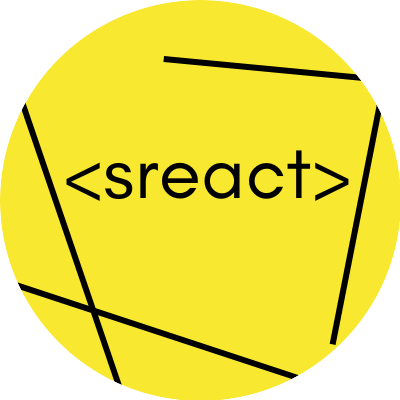
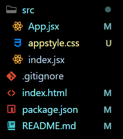

<p align="center">
  
</p>
<p align="center">
  ⚡ A small, clutter-free react app maker.
</p>

<p align="center">
  
  
</p>

---

File Structure is minimal:




## Install or use

Try now with:

```
npx make-sreact-app my-app
```

For Typescript, run this:

```
npx make-sreact-app my-app --ts
```

- Default JS template: https://github.com/AsherCarneiro/template-js
- Typescript template: https://github.com/AsherCarneiro/template-ts

## Run the app locally

Use:
```
npm start
```

